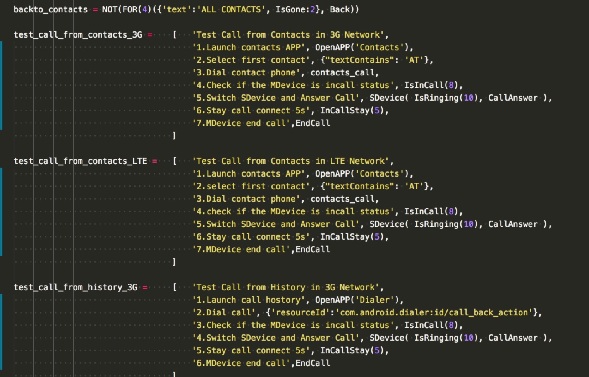
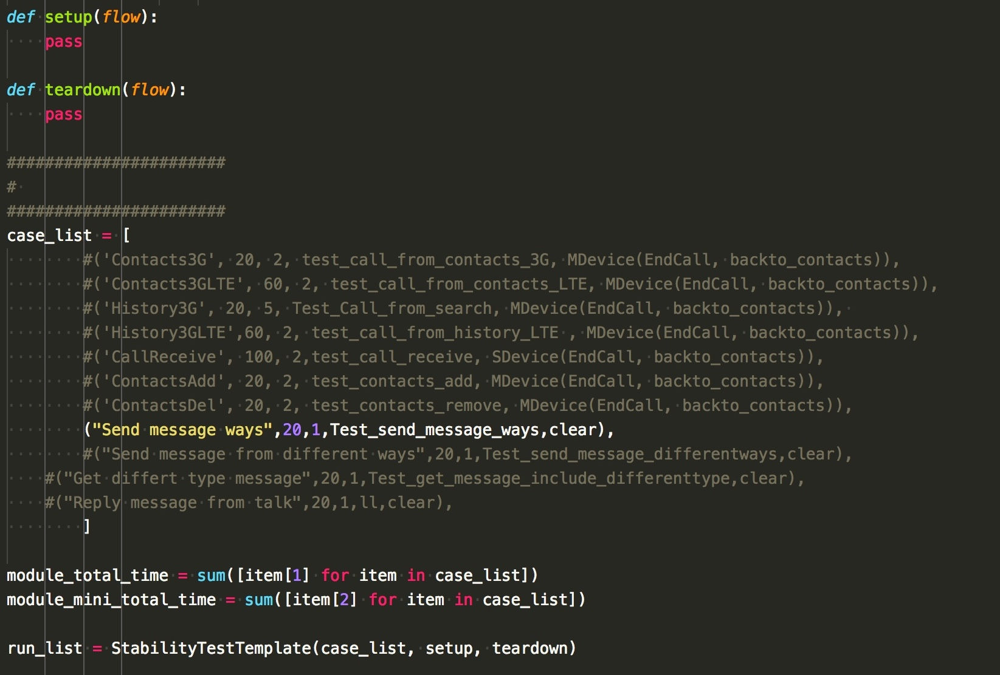

# yaya

The yaya is The Android Test Framework. Based on [atx-uiautomator](https://github.com/openatx/atx-uiautomator)

## 思想：少就是多
   - 让写脚本人做的少，框架本身做的多。
框架的目的就是让写脚本变得简单，让写脚本的人只需关注测试case的步骤即可，其他事情交给框架。
   - 它是对测试逻辑层的封装，只需要知道测试case流程，就可以跑测试，不需要具体详细的逻辑，更贴近测试人员的思维方式测试引擎。

## 概念
   - Step： 单个步骤，比如：打印一个句log，点击一个控件，launch一个APP
   - Flow：有步骤流，比如：步骤组成列表[“Start Test”, OpenAPP(“Call”), Home]
   - Template：业务模块，case运行业务流程封装,比如：StabilityTestTemplate

## 举例
具体可以看[01_Telephony.py](01_Telephony.py), [02_Messaging.py](02_Messaging.py), [10_wifi.py](10_wifi.py)

 1.case流程，每个case放入一个列表容器
 
 2.每个module所有case可以放入case list，根据上层业务不同，放入不同Template, 这里举例是StabilityTest，得到最终的**run-list**
 
 
## 其他功能
   - log记录
   - 导出测试数据，
   - 出错截图，dump
   - ANR和Crash监控

## 当前状态
现在还是beta阶段，需要大家一起完善它。
 
## 安装
**need system : Ubuntu 14 ,Ubuntu 16，macOS**

### 1.创建一个独立的python环境
    $ pip install atx-uiautomator

    $ pip install opencv-python
    
这里还需要安装其它python包，我这里没有列出来，等日后完善了，

### 2.修改配置文件
    $ cd "code-path"

    $ gedit cfg/common.ini

    $ modify "mdev" and "sdev" to local device serial in the "[Run Info]"

    $ python run.py  